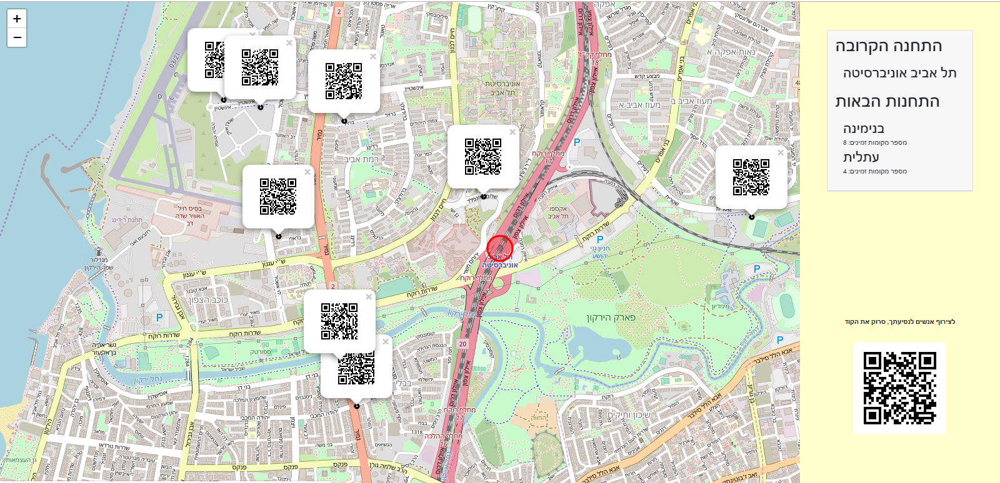
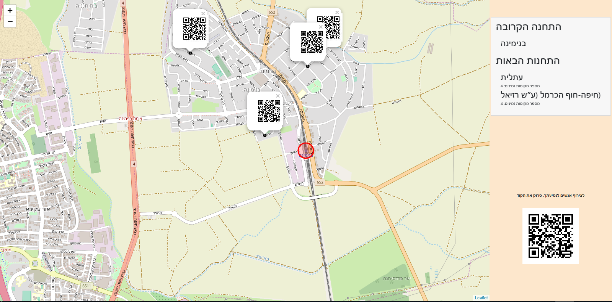

# PickUpStop
A digital board that manages rides from train stations to nearby areas

* Michale Walles
* Ruhami Tehila Bichman
* Elisheva Shmuel
* Shilat Mayzel Feuchtwanger

## Screenshots

after scanning QR code in the right: 

### Prerequisites
* Python 3.7

### Setup
* Clone or download this repo from github

### Run
To run this project use:

    python manage.py runServer
    and press on the link

## Credits and References
thanks a lot to Ronny Sherer and Udi Oron for the lot of help
