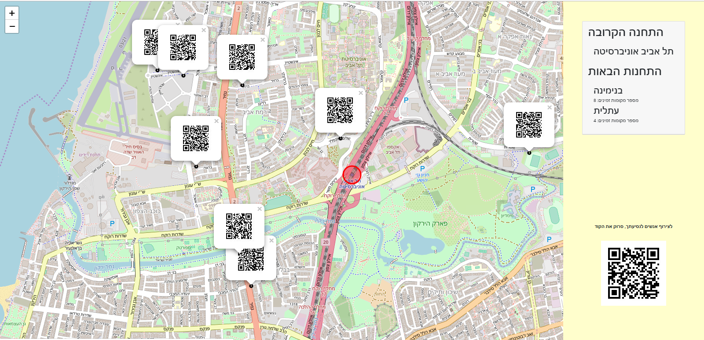
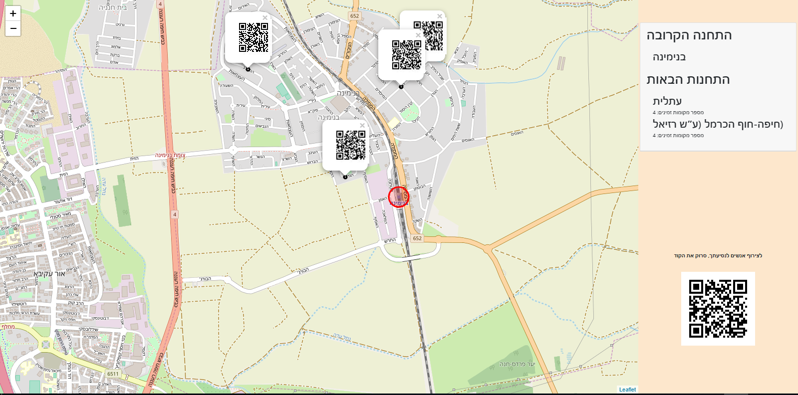
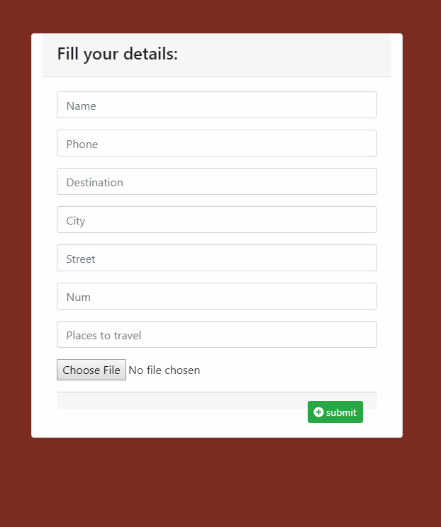

# PickUpStop
A digital board that manages rides from train stations to nearby areas

* Michale Walles
* Ruhami Tehila Bichman
* Elisheva Shmuel
* Shilat Mayzel Feuchtwanger

## Screenshots

The red circle indicates the location of the nearest station, 
The QR codes on the map indicate destination points for car owners who want to take hitchhikers with them

after scanning QR code in the right: 

### Prerequisites
* Python 3.7

### Setup
* Clone or download this repo from github

### Run
To run this project use:

    python manage.py runServer
    and press on the link

## Credits and References
thanks a lot to Ronny Sherer and Udi Oron for the lot of help

